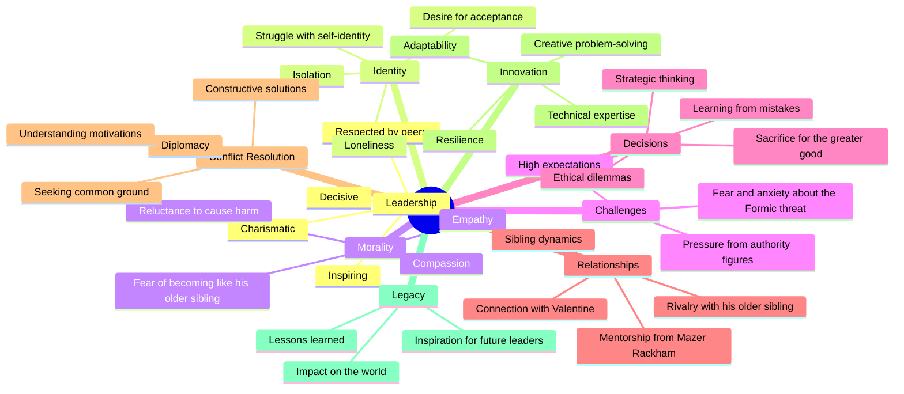

A brilliant young boy, Andrew "Ender" Wiggin lives with his kind but distant parents, his sadistic brother Peter, and the person he loves more than anyone else, his sister Valentine.

What-If... Edward Williams, a system architect, a visionary leader, and a master at eliminating bugs with resilience solutions. Just like Ender Wiggin, they face their share of challenges, from isolation and rivalry to pressure from stakeholders and the relentless pursuit of perfection.

